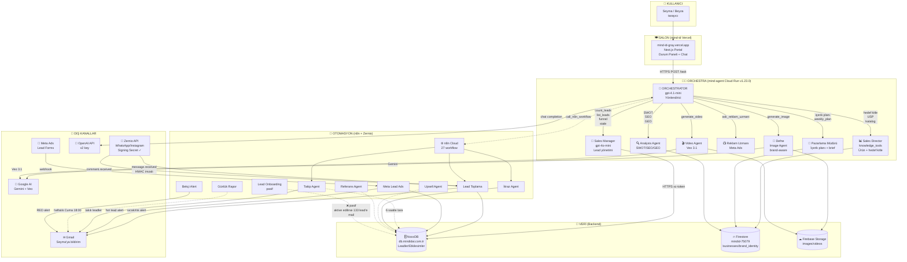

# 🎼 MINDID ARCHITECTURE — Orchestra Map
**Son güncelleme:** 2026-05-22 (v1.23.0 deploy sonrası)

## 📊 Genel Akış (Mermaid)



---

## 🎼 ORCHESTRA ŞEFI VE EKİBİ (Hiyerarşi)

```
                    ┌─────────────────────────┐
                    │  🎼 ORCHESTRATOR        │
                    │  (gpt-4.1-mini)         │
                    │  Karar verir, yönlendir │
                    └────────────┬────────────┘
                                 │
        ┌────────────┬───────────┼───────────┬────────────┐
        │            │           │           │            │
   ┌────▼────┐  ┌────▼────┐ ┌────▼────┐ ┌────▼────┐  ┌────▼────┐
   │💼 Sales │  │📊 Sales │ │📣 Paz.  │ │🎨 Defne │  │🎬 Video │
   │Manager  │  │Director │ │Müdürü   │ │(Image)  │  │Agent    │
   │gpt-4o-m │  │knowledge│ │içerik   │ │brand-   │  │Veo 3.1  │
   │         │  │tools    │ │planı    │ │aware    │  │         │
   └────┬────┘  └────┬────┘ └────┬────┘ └────┬────┘  └────┬────┘
        │            │           │           │            │
        │       ┌────▼────┐      │           │            │
        │       │📺 Reklam│      │           │            │
        │       │Uzmanı   │      │           │            │
        │       │Meta Ads │      │           │            │
        │       └─────────┘      │           │            │
        │                        │           │            │
        │                   ┌────▼─────┐     │            │
        │                   │🔍 Analyz │     │            │
        │                   │SWOT/SEO  │     │            │
        │                   └──────────┘     │            │
        │                                    │            │
        ▼                                    ▼            ▼
  count_leads                            Gemini AI    Veo 3.1
  list_leads                             Storage      Storage
  stale_leads
  funnel
  weekly_kpi
        │
        ▼
   ┌────────────────┐
   │ 🗄 NocoDB      │
   │ HTTPS Caddy    │
   │ 133 sıcak lead │
   └────────────────┘
```

---

## 🔄 4 TAVAN KATMAN

```
┌──────────────────────────────────────────────────────────────┐
│  1. SALON         mind-id (Next.js, Vercel)                  │
│                   • Portal UI • Durum/Versiyon paneli        │
│                   • MindBot chat • 9/9 ✅                    │
└──────────────────────┬───────────────────────────────────────┘
                       │ HTTPS /task
                       ▼
┌──────────────────────────────────────────────────────────────┐
│  2. ORCHESTRA     mind-agent (Cloud Run v1.23.0)             │
│                   • 7 ajan • Multi-agent SDK                 │
│                   • revision 00011-gex                       │
└────┬───────────────────────────────────────────────┬─────────┘
     │                                               │
     │ HTTPS                                         │ API
     ▼                                               ▼
┌────────────────┐                            ┌─────────────────┐
│ 3. DEPO        │                            │ 4. OTOMASYON    │
│ NocoDB CRM     │ ◄──── 27 n8n workflow ─────│ n8n + Zernio    │
│ Firestore      │       (Lead Toplama,       │ WhatsApp/IG     │
│ Storage        │        Takip, İtiraz...)   │ Meta Ads        │
└────────────────┘                            └─────────────────┘
```

---

## 📞 KİM KİMİNLE KONUŞUYOR (Tablo)

| Kim | Kime | Neyi | Nasıl |
|-----|------|------|-------|
| 👤 Seyma | mind-id | Soru/komut | Tarayıcı UI |
| mind-id | Orchestrator | `POST /task` | HTTPS, Bearer auth |
| Orchestrator | Sales Manager | "Lead bilgisi gerek" | function_tool çağrısı |
| Orchestrator | Defne | "Görsel üret" | function_tool |
| Orchestrator | Video Agent | "Video üret" | function_tool |
| Sales Manager | NocoDB | Lead query | xc-token + HTTPS |
| Defne | Firestore | brand_identity oku | Firebase Admin SDK |
| Defne | Gemini AI | Görsel prompt | Google AI API |
| Defne | Storage | Görsel kaydet | Firebase Storage |
| Analysis Agent | Web | Scrape SEO | Serper.dev |
| Sales Director | Firestore | Knowledge query | Firebase Admin |
| Pazarlama Müdürü | Defne | Brief gönder | Peer tool |
| Sales Manager | Reklam Uzmanı | `ask_reklam_uzmani` | Peer tool |
| Zernio | n8n Lead Toplama | message.received + HMAC | HTTPS webhook |
| n8n Lead Toplama | NocoDB | Insert lead | xc-token |
| n8n Lead Toplama | Gmail | Sıcak/ılık alert | SMTP |
| Meta Ads | n8n Meta Lead Ads | Lead form | Webhook |
| n8n Takip Agent | NocoDB | Stale tara | Schedule 6sa |
| Orchestrator | n8n | `call_n8n_workflow` | n8n REST API |
| Bekçi Robot | n8n Bekçi Alert | RED state | HTTPS |

---

## 🛡 GÜVENLİK KATMANLARI (Bugün eklenenler)

```
[İnternet]
    ↓ HTTPS Let's Encrypt
[Caddy reverse proxy]
    ↓ IP whitelist (Seyma 185.98.219.69) + API path open
    ↓ HTTP→HTTPS otomatik yönlendirme
[NocoDB 127.0.0.1:8080]
    ↓ xc-token auth (v2 rotated)
[SQLite volume]
    └ 133 sıcak lead

[Zernio]
    ↓ Signing Secret ✓ (HMAC-SHA256 imzalı)
[n8n Lead Toplama]
    ↓ (n8n HMAC doğrulama: ileride)
[NocoDB]

[Firestore]
    ↓ Custom claim: admin=true (Seyma + Beyza)
    ↓ {collection}/{document=**} per-collection rules
```

---

## 📦 KOMPONENT VERSİYONLARI

| Komponent | Versiyon | Konum |
|---|---|---|
| mind-agent image | `v1.23.0` (sha 822695a7) | Artifact Registry |
| Cloud Run revision (canlı) | `agents-sdk-api-00011-gex` | us-central1 |
| Cloud Run revision (rollback) | `agents-sdk-api-00008-bnk` | hazır beklemede |
| mind-id production | merged main | mind-id-gray.vercel.app |
| Orchestrator model | gpt-4.1-mini | OpenAI |
| Sales Manager model | gpt-4o-mini | OpenAI |
| Image model | gpt-image-1 | OpenAI |
| Video model | veo-3.1-lite-generate-preview | Google AI |
| NocoDB image | nocodb/nocodb:latest | Docker Hub |
| Caddy | 2.11.3 | Cloudsmith |
| n8n workflow count | 27 aktif | mindidai.app.n8n.cloud |

---

## 🎯 BUGÜN AÇTIĞIMIZ İŞ AKIŞLARI

1. **Kullanıcı sorusu** (örn: "kac sicak lead var")
   - Seyma → mind-id → Orchestrator → Sales Manager → count_leads → NocoDB → "133 sıcak lead" → Gmail bildirim (zaten varsa)

2. **WhatsApp gelen mesaj**
   - Müşteri WhatsApp yazar → Zernio (HMAC imzalar) → n8n Lead Toplama → NocoDB + Seyma'ya mail

3. **Marka kimlikli görsel** (Faz A altyapısı hazır, henüz aktif değil)
   - Seyma "banner oluştur" → Orchestrator → Defne → Firestore brand_identity oku → Gemini'a prompt + brand → görsel → Storage

4. **Reklam stratejisi**
   - Seyma "meta reklam öner" → Orchestrator → Sales Manager → ask_reklam_uzmani → Reklam Uzmanı → strateji metni

---

## 📋 PASİF / İLERİDE YAPILACAKLAR

```
[ ] Faz B1: Brand Synthesis Agent (website + IG scrape → brand_identity draft)
[ ] Faz B2: mind-id "İşletme Ekle" wizard
[ ] Faz C: Diğer ajanlar brand_identity okusun
[ ] Faz D: Brand-fit scorer + drift
[ ] customer_agent: LinkedIn workflow
[ ] customer_agent: Clay workflow
[ ] customer_agent: IG DM bot workflow
[ ] Lead Onboarding aktive (133 lead'e mail dizisi, onay gerek)
[ ] n8n HMAC verification (Zernio signature verify)
[ ] Static egress IP + tam firewall ($5-8/ay)
[ ] Güvenlik borçları (eski key/token revoke)
```

---

## 👤 İNSAN HİYERARŞİSİ

```
SEYMA (kurucu, kapanış, onay)
    ↓
BEYZA (operasyon, admin)
    ↓
EMIR (planlama — admin claim henüz yok)
```

---

## 🆘 ACİL DURUM ROLLBACK

```bash
# Eğer v1.23.0 sorunlu çıkarsa:
gcloud run services update-traffic agents-sdk-api \
  --project=instagram-post-bot-471518 --region=us-central1 \
  --to-revisions=agents-sdk-api-00008-bnk=100

# Eğer NocoDB HTTPS sorunlu çıkarsa, eski HTTP:
# Cloud Run: NOCODB_BASE_URL=http://34.26.138.196 set et
```
